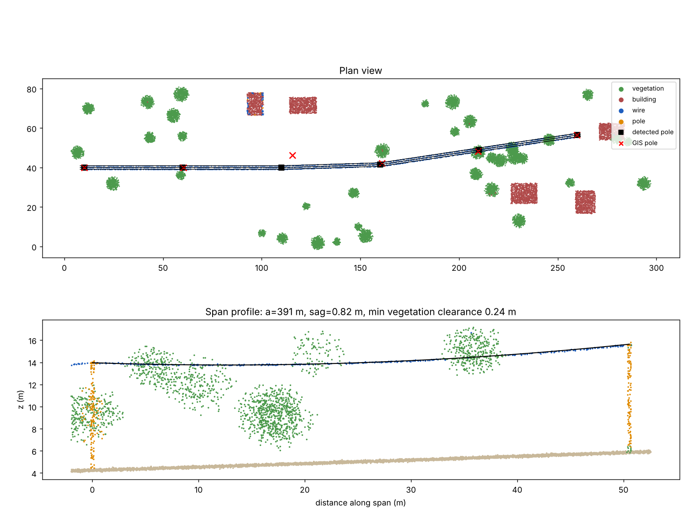

# lidar-to-grid

Reconstruct an overhead electricity network (poles, spans, individual conductors) from airborne LiDAR, then check it against an imperfect GIS record.

Utilities' GIS records drift: poles are metres off, spans are missing, rebuilt lines are never updated. LiDAR shows what is actually there. This repo turns classified points into a network model that can be used for sag, clearance and GIS QA.



## Pipeline

```
LAS/LAZ ──► ground filter (PMF) ──► height above ground
        ──► multi-scale geometric features (covariance eigenfeatures, verticality, column stats)
        ──► point classifier (gradient boosting, spatially blocked CV)
        ──► pole detection (DBSCAN on XY + height test)
        ──► span assignment (wire points ↔ neighbouring pole pairs, coverage check)
        ──► split parallel conductors ──► catenary fit per conductor (a, sag, RMSE)
        ──► network graph (poles = nodes, spans = edges) ──► GeoJSON
        ──► vegetation clearance per conductor ──► GIS comparison (missing spans, misplaced poles)
```

Design choices worth noting:

- **Spatial cross-validation.** Neighbouring points are near-duplicates; random splits leak and inflate scores. Folds are 50 m spatial blocks.
- **Spans are anchored on structures.** Wire points are assigned to the nearest pair of neighbouring poles, shortest pairs first, and a candidate span must be covered by wire points along most of its length. Wires that fit no span are kept as *unanchored* conductors: they usually mean a missed pole and are QA candidates.
- **Physics in the loop.** Each conductor is fitted with a catenary `z = c + a(cosh((s - s0)/a) - 1)` using a robust loss. The parameter `a` (horizontal tension / weight per metre) and the sag (~ L²/8a) are physically meaningful and give a sanity check on the classifier: a "wire" whose fit has huge RMSE or an absurd `a` is probably not a wire.
- **Robust clearance.** Clearance uses the distance to the k-th nearest vegetation point, so a few misclassified points don't create false encroachments.

## Results

**Synthetic scene** (`scripts/run_synthetic.py`, train on one scene, test on another): all 6 poles and 15/15 conductors recovered, catenary `a` within ~2% of the true 400 m, and the GIS check flags the injected dropped span and the misplaced pole. Synthetic data is easy (point-classifier mIoU 0.95), so these numbers prove the pipeline logic, not real-world accuracy.

**Real data (ECLAIR, Sharper Shape, CVPRW 2024):** in progress. ECLAIR labels transmission wires, distribution wires, poles and transmission towers separately at ~50 pts/m².

## Run

```bash
pip install -e ".[dev]"
pytest -q
python scripts/run_synthetic.py --out outputs/synthetic
```

## Roadmap

- [ ] ECLAIR loader + per-class IoU with spatial CV, error analysis on thin structures
- [ ] Deep learning baseline (PointNet++ / sparse convolution) against the classical model
- [ ] Drift check between acquisitions (feature distributions, per-tile confidence)
- [ ] Tiled processing for large areas (COPC / EPT input, parallel per tile)
